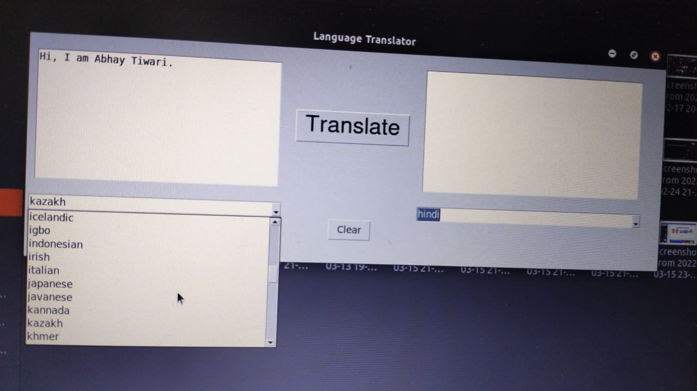

# Language Translator App

## Using tkinter for GUI and Googletrans Api & textblob

This python app is created using **tkinter — Python interface to Tcl/Tk** for creating the GUI. At the backend of the app googletrans API is used for translating the entire sentence by using textblob.

## Cross Platform

*Tk is the only cross-platform (Windows, Mac, Unix) graphical user interface toolkit designed exclusively for high-level dynamic languages, like Python, Tcl, Ruby, Perl, and many others. Whatever language you use, this site brings you the current, high-quality essential information you need to get the most out of Tk.*

Thus we can run this simple GUI program on any of the operating system whether it is macOS, Unix, Windows.

### Languages Supported

We can translate our text in 107 different languages given below with just a single click.

<aside>
🈳 ['afrikaans', 'albanian', 'amharic', 'arabic', 'armenian', 'azerbaijani', 'basque', 'belarusian', 'bengali', 'bosnian', 'bulgarian', 'catalan', 'cebuano', 'chichewa', 'chinese (simplified)', 'chinese (traditional)', 'corsican', 'croatian', 'czech', 'danish', 'dutch', 'english', 'esperanto', 'estonian', 'filipino', 'finnish', 'french', 'frisian', 'galician', 'georgian', 'german', 'greek', 'gujarati', 'haitian creole', 'hausa', 'hawaiian', 'hebrew', 'hebrew', 'hindi', 'hmong', 'hungarian', 'icelandic', 'igbo', 'indonesian', 'irish', 'italian', 'japanese', 'javanese', 'kannada', 'kazakh', 'khmer', 'korean', 'kurdish (kurmanji)', 'kyrgyz', 'lao', 'latin', 'latvian', 'lithuanian', 'luxembourgish', 'macedonian', 'malagasy', 'malay', 'malayalam', 'maltese', 'maori', 'marathi', 'mongolian', 'myanmar (burmese)', 'nepali', 'norwegian', 'odia', 'pashto', 'persian', 'polish', 'portuguese', 'punjabi', 'romanian', 'russian', 'samoan', 'scots gaelic', 'serbian', 'sesotho', 'shona', 'sindhi', 'sinhala', 'slovak', 'slovenian', 'somali', 'spanish', 'sundanese', 'swahili', 'swedish', 'tajik', 'tamil', 'telugu', 'thai', 'turkish', 'ukrainian', 'urdu', 'uyghur', 'uzbek', 'vietnamese', 'welsh', 'xhosa', 'yiddish', 'yoruba', 'zulu']

</aside>

### 3 Step Process

At first we store the input text in a variable by using textblob for later manipulation purposes.


Then we’ve to select the language for input text using a dropdown list which consists of 107 languages in total.



Then in backend we pass the text to a translator function that uses googletrans API for further translation.

```python
def translate_it():
    # Delete any previous text inside the text box
    translated_text.delete(1.0, END)
    try:
        # get languages from dictionary keys
        # get the from language key
        for key, value in languages.items():
            if(value == original_combo.get()):
                from_language_key = key
        # get the to language key
        for key, value in languages.items():
            if(value == translated_combo.get()):
                to_language_key = key
        # Turn Original text into a TextBlob
        words = textblob.TextBlob(original_text.get(1.0, END))
        # Translate Text
        words = words.translate(
            from_lang=from_language_key, to=to_language_key)
        # Output translated text to screen
        translated_text.insert(1.0, words)
    except Exception as e:
        messagebox.showerror("Translator", e)
```

Translator function returns the translated text according to the language chosen by the user and displays it on the screen.


